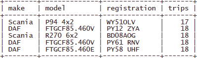
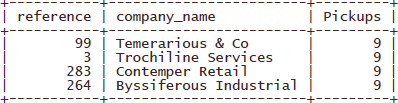
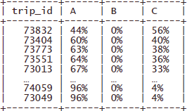
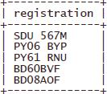
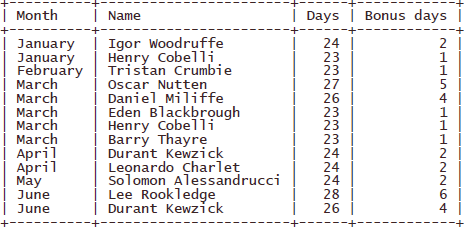

# Problems

1) Find the five trucks that are least used during the six months covered by the data. Order by the number of trips they were used on.
   Expected restult:
   
   
   
2) Each month the company emails the FOUR customers with the highest number of pickups (not manifest items) to check they are happy with the service. List the top FOUR customers for June.
   Expected restult:
   
   
   
3) For all trips where hazardous good were transported, find the percentage of each category of item in the manifest. Sort in descending order of the percentage of hazardous items. (NB Output is abbreviated – in your submission, all 48 rows should be included.)
   Expected restult:
   
   
   
4) List the registration numbers of the trucks that were not in use between 1 and 5 April inclusive.
   Expected restult:
   
   
   
5) If a driver works more than 22 days in any one month, they are paid at a higher rate for the extra days. List the drivers who qualify for bonus payments for each month in the data and include the number of extra days worked. Drivers who are not eligible for a bonus should not be shown. Order by month and number of days descending.
   Expected restult:
   
   
