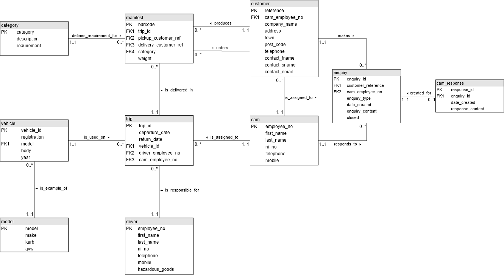

# Requirements

The following facilities are required:
- Only drivers are currently recorded – a new staff role of customer account manager (CAM) is needed.
- Every customer must be assigned a CAM, and one CAM can serve several customers
- CAMs may change over time – it must be possible to find out who was the CAM at the time of any trip, even if that person has subsequently left the company
- It must be possible to identify a customer’s current CAM
- The details of any initial customer enquiry must be recorded
- The CAM’s response must be recorded (potentially at a later date than the original query)
- Queries must be marked as closed when no further action is required

# Solution

The Database Alteration file holds the sql statements used to alter the database. Below is a diagram of the newly edited database:

